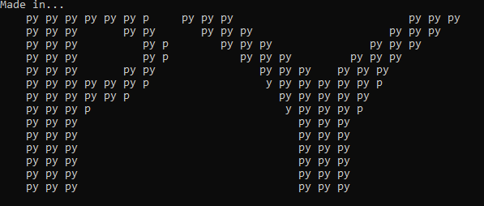
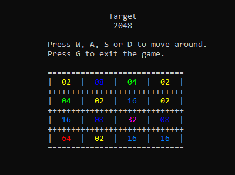

# Terminal 2048 Game  

A **terminal-based** version of the popular **2048** game with unique features, such as difficulty levels and colorful visuals. Developed by **LeeTuah** and **giornoexe0**.  

## Features  

✅ **Multiple Difficulty Levels** – Easy, Regular, Hard, and Souls-like.  
✅ **Color-coded Tiles** – Easily distinguish numbers.  
✅ **Keyboard Controls** – Move using `W`, `A`, `S`, `D`.  
✅ **Game Over & Win Conditions** – Reach the target tile to win.  
✅ **ASCII Intro Screen & Music** – Cool effects before the game starts.  

## Installation  

### Prerequisites  

Make sure you have **Python 3** installed. You also need the following dependencies:  

```sh
pip install pynput sty pygame
```

## How to Play  

1. **Run the game**:  

   ```sh
   python main.py
   ```

2. **Fullscreen the terminal** before starting.  
3. **Choose a difficulty** from the menu.  
4. **Use these controls to play**:  
   - `W` → Move Up  
   - `A` → Move Left  
   - `S` → Move Down  
   - `D` → Move Right  
   - `G` → Quit the game  

5. **Merge numbers** to reach the **target tile** (2048, 4096, or 8192 depending on difficulty).  

## Screenshots

🎨 **Colorful grid with number tiles**  
🎵 **ASCII intro animation with background music**   





## Contributors  

💡 **LeeTuah**  
💡 **giornoexe0**  

## Notes

1. For the folks on Windows, we have provided an executable for you so you do not need to install python or the libraries.

## License  

This project is **open-source**. Feel free to modify and improve it!  
